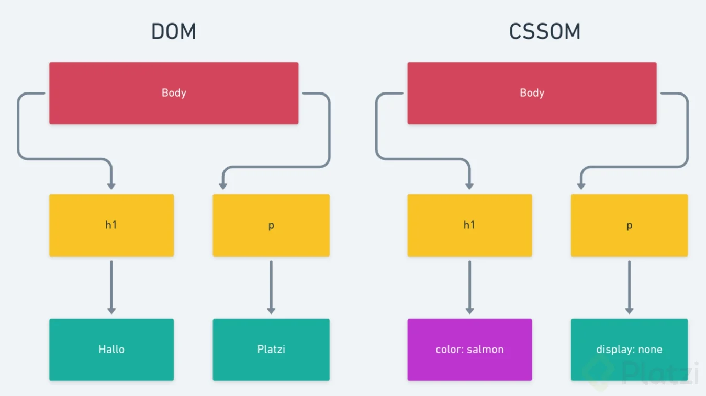

# Manipulación del DOM

## DOM


Es lo que los navegadores utilizan para renderizar y trabajar sobre una página web.


### Critical Rendiring Path

Es un proceso que los navegadores hacen para interpretar los lenguajes ```html```, ```css``` y ```JavaScript```, y transformalos en pixeles de las pantallas de los usuarios.

Ruta o acceso de representación crítica.

1. **```Conversión```** 
2. **```Tokenización```**
3. **```Construcción del DOM```**


#### DOM

(Document Object Model), arbol que realiza con el marcado del ```HTML```.


#### CSSOM

(CSS Object Model): arol que realiza con el código CSS de la página.





## Web APIs (Application Program Interface)

(Las Interfaces de Programación de Aplicaciones). Es lo que nos permite conectar el DOM con JavaScript, para poder manipular y modificar este mismo.

Son una manera sencilla de acceder a la información o funcionalidad de otro pedazo de código. Por eso se le conoce como puentes o intermediarios. porque nos facilita conectarnos a funcionalidades complejas con una sintaxis mucho más sencilla.


## Leer Nodos


### document.getElementById

Esto para obtener un elemento del DOM por su **ID**.

```javascript
document.getElementById('firstName')

/* Nos devuelve el elemento especifico que con el ID firstName
	<input type="text" class="form-control" id="firstName" placeholder="First Name" required>...</input>
*/
```

### parent.getElementByTagName

Esto para obtener un elemento del DOM por el nombre de la etiqueta.

```javascript
document.getElementByTagName('input')

/* Nos devuelve una coleccion de las etiquetas espeficadas
	HTMLCollection(12) [input.form-control,
	<input type="text" class="form-control" id="firstName" placeholder="First Name" required>...</input>
	...
	]
*/
```

### parent.getElementByClassName

Con esto obtenemos un elemento o conjunto de elementos del DOM por su atributo **clase**.

```javascript
document.getElementByClassName('form-control')

/* Nos devuelve una coleccion que contengan la clase especificada
	HTMLCollection(12) [input.form-control,
	<input type="text" class="form-control" id="firstName" placeholder="First Name" required>...</input>
	...
	]
*/
```

### parent.querySelector()

Nos devuelve el primer elemento del padre especificado, (en su mayoria de ocaciones el document), que coincida con el grurpo especificado se selectores.

```javascript
const firstName = document.querySelector('.firstName')
```

El parametro que le pasemos o indiquemos estan muy ligados a los selectores CSS, por ejemplo **ID**, **clases**, **tagName** etc. En otras palabras podemos pasarle cualquier selector válido de ***CSS***.

### parent.querySelectorAll()

Nos devuelve todos los elementos en forma de un ***NodeList*** que concuerden con el parámetro especifícado.

```javascript
const inputs = document.querySelectorAll('input')

/*
	NodeList(17) [input.form-control,
	input#name.formControl, input#lastName.form-control,
	input#username.formControl, input#email.form-control,
	...
	...
	]
*/
```


## NodeLists vs Array

La diferencia enter NodeList y Array, es que el NodeList carece de métodos que si están disponibles en los Arrays, pero podemos pasar esto fácilmente usando el operador de ***Spread Opedator***.

```javascript
const nodeList = document.querySelectorAll('.selector')
const elementList = [...nodeList]

// De esta forma pasamos los elementos en el NodeList a un arreglo al cual si podremos usar los métodos como filter, map, reduce entre otros.
```

Como recomendación importante es pasar un NodeList a Array esto porque lo motores de JavaScript com el motor V8 de Google Chrome están más optimizados para Arrays que para NodeList.


## Crear Nodos


### document.createElement

Creamor un nodo listo para poder usarlo donde requiera.

```javascript
document.createElement('h1')
/*
	De esta manera podemos crear un elemento, la creacion se hace en memoria tendriamos que insertarlo de manera explicita en el DOM
*/
```

### document.createTextContent

Este método nos permite crear un texto  para luego poder insertalo dentro de un elemento.

```javascript
document.createTextNode('Hola, Mundo!')
/*
Solo se a creado, aun no se agrega al DOM
*/
```


## Agregar Nodos

### parentElement.appendChild

Este metodo siempre nos agrega el nodo especifico al final.

```javascript
const container = querySelector('div.py5.text-center') // seleccionamos el elemento padre 
const h3 = document.createElement('h3') // Se crea un nuevo nodo
const texto = document.createTextNode('hello') // se crea un nuevo texto

container.appendChild(h3) // insertamos el nodo(h3) al elemento padre(container)
h3.appendChild(texto) // insertamos el texto(texto) al nodo(h3)


// con esto creamos un elemento h3 y le agregamos un texto
```

### parentElement.append

Este método es la evolución de **appendChild**, se puede agregar más de un nodo, agregar un texto, aunque no esta soportado por IE 11.

```javascript
container.append('Hello', document.createElement('div'))

// con esto agregamos un texto directamente al elemento padre, tambien creamos un elemento div y le agregamos un texto
```

### parentElement.insertBefore

Inserta nodos antes del elemento que le pasemos como referencia, este nodo de referencia tiene que ser hijo directo del padre.

```javascript
const parentElement = querySelecto('padre') // Obtengo el elemento padre
const titulo = document.createElement('h1') // Creo un elemento
const referencia = document.querySelector('h2') // obtengo la referencia del elemento del que quiero insertar antes

parentElement.insertBefore(titulo, referencia) // Insertamos titulo dentro de parentElement justo antes de h2 que es nuestra referencia.

```


### parentElement.insertAdjacentElement

Inserta nodos según las opciones que le pasemos:

-	**```beforebegin```**: Lo inserta antes del nodo.
-	**```afterbegin```**: Lo inserta despues del nodo.
-	**```beforeend```**: Lo inserta antes de donde finaliza el nodo.
-	**```afterend```**: Lo inserta despues de donde finaliza el nodo.

```javascript
const parentElement = document.querySelector('parent') // Seleciono el padre
const nodo = document.createElement('span') // Se crea un elemento span

parentElement.insertAdjacentElement('beforebegin', nodo) 
```


## Otras Formas de Agregar Nodos

Existen otras formas de agregar nodos:

- `node.outerHTML`: Sirve para leer HTML, nos devuelde el elemento o nodo seleccionado en forma de una cadena de texto.

- `node.innerHTML:` Sirve para escribir HTML, nos devuelve el valor del elemento, como tambien podemos reemplazar ese valor por uno nuevo.


  El problema con estas formas de inserciones es que permiten la inserción XSS, es decir, código maligno, y cualquier usuario programador malicioso podría meter scripts molestos, ¡Sería catastrófico! Siempre sanitiza (remover caracteres especiales) de las entradas que hagan los usuarios.

## Atributos y Propiedades

**Atributo** es el estado inicial en nuestro HTML, en HTML solo podemos escribir atributos porque es el estado inicial con el que se renderizan

**Propiedad** es la variable que podemos cambiar a lo largo de la ejecución del programa mediante JavaScript, es decir, podemos acceder a dichos atributos y cambiarlo, haciendo que sean propiedades,


## Eliminar Nodos

### parentElement.removeChild

Nos permite eliminar un nodo especifico.

```javascript
const nodoEliminar = querySelector('h1') // seleccionar el nodo a eliminar
const padre = querySelector('div.container') // seleccion del padre directo del nodo a eliminar

padre.removeChild(nodoEliminar) // se elimina el nodo

// podemos eliminar un nodo de la siguiente manera
const padre2 = nodoAEliminar.parentElement // seleccionamos el padre del nodo a eliminar con la propiedad (parentElement)
padre2.removeChild(nodoAEliminar) // eliminanos el nodo
```


### document.remove

Es la evolución de ***removeChild***, este método no requiere de un nodo padre ni referencia alguna, con solo seleccionar o indicar el nodo a eliminar y el metodo ```.remove()``` se elimina.

```javascript
const elementoEliminar = document.querySelector('.elemento') // seleccionamos el elemento a eliminar
elementoEliminar.remove() // eliminamos el elemento
```


### node.replaceChild

Este método requiere el padre, el elemento a reemplazar y el elemento de referencia. 

Al método le pasamos dos parámetros, el primero es el elemento Nuevo y el segundo es el elemento o referencia del elemento a reemplaza, ```parentElement.replaceChild(newElement, elementReplace)``` .

```javascript
const elementoPadre = document.querySelector('.parentElement') // selecionar el nodo padre
const elementoReemplazo = document.querySelector('.elementReplace') // seleccionador la referencia del elemento a reemplazar
const elementoNuevo = document.createElement('.newElement') // se crea el nuevo elemento

elementoNuevo.textContent = 'Texto Nuevo' // agregamos texto al nuevo elemento

elementoPadre.replaceChild(elementoNuevo, elementoReemplazo) // utilizamos el método .replaceChild() para realizar el reemplazo de elemento
```


## Operaciones en Lote

Realizar mutaciones en el DOM tiene un costo, entre menos operaciones realicemos en el  DOM especialmente escribir y eliminar cosas más rápido sera el website.

Ejemplo de escribir 100 inputs en el DOM

***No Optimo***

```javascript
for(let i = 0; i < 100; i++) {
    const node = document.createElement('input')
    document.body.appendChild(node) // modificamos 100 veces
}
```

***Optimo***

````javascript
const nodos = []
for(let i = 0; i < 100; i++) {
    const node = document.createElement('input')
    nodos.push(node)
}

document.body.append(...nodos) // modificamos 1 sola vez
````

